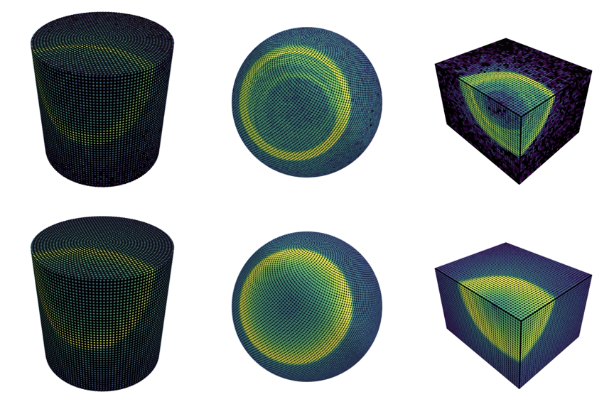

# LUCiD: a Light-based Unified Calibration and trackIng Differentiable simulation

🚧 **Under Construction** — Code is being refactored and reorganized. A stable release is coming soon.

A high-performance, differentiable simulation framework for optical particle detectors. This project enables gradient-based optimization of calibration parameters and particle reconstruction using automatic differentiation.



## Quick start

Produce v3 events end-to-end on your own machine:

- [Local quickstart](docs/QUICKSTART_LOCAL.md) — clone, build PhotonSim, `pip install -e .`, run `lucid-run-job`.
- [S3DF quickstart](docs/QUICKSTART_S3DF.md) — SLURM + singularity deployment for SLAC users.

The single-job entry point is `lucid-run-job` (`lucid/production/run_job.py`); 12 bundled configs live at `lucid/production/configs/`. See [LUCID_DATASET.md](docs/LUCID_DATASET.md) for the v3 schema.

## Overview

LUCiD provides a JAX-based differentiable simulation of light propagation in optical detectors. Key features include:

- **Differentiable ray-tracing** with automatic differentiation for gradient-based optimization
- **Physics-informed neural network (SIREN)** as surrogate model for Cherenkov emission
- **Multi-geometry support**: cylindrical, spherical, and box detectors. Cylinders can be either algorithmically tiled (e.g. `SK_like`, `WCTE_like`) or built from measured PMT positions in a `.npz` file (`SK`, `HK`, `WCTE` from public WCSim geofiles)
- **Particle track reconstruction** via gradient descent with position, direction, initial time, and energy inference
- **Detector calibration** for optical parameters (scattering, absorption, reflection, quantum efficiency)
- **Wavelength-dependent physics**: per-photon scattering, absorption, and QE driven by medium models and PMT curves
- **Composable physics configs**: each detector property independently chooses scalar or wavelength-dependent representation
- **Gradient analysis tools**: 1D/2D parameter sweeps with loss landscapes and gradient fields

## Core Components

### Simulation (`lucid/simulation/`)
- **`simulator.py`** - Main event simulator with photon propagation and sensor response
- **`photon_step.py`** - Per-photon propagation step (scattering, reflection, absorption)
- **`sensor_response.py`** - Sensor hit aggregation for simulation, data, and likelihood modes

### Geometry (`lucid/geometry/`)
- **`cylinder.py`**, **`sphere.py`**, **`box.py`** - Detector geometries with sensor placement and ray intersection. `Cylinder` can be built either algorithmically or via `Cylinder.from_pmt_file(npz_path)` from a unified PMT-array `.npz` (used by SK, HK, WCTE).
- **`PMT_NPZ_SCHEMA.md`** - Authoritative schema for the PMT-array `.npz` files; converters in `config/scripts/` produce these from public WCSim geofiles.
- **`registry.py`** - Detector type registration and dispatch

### Wavelength (`lucid/wavelength/`)
- **`medium.py`** - Wavelength-dependent optical properties (Rayleigh scattering, absorption, QE curves)
- **`spectrum.py`** - Cherenkov wavelength sampling via inverse CDF

### Propagation (`lucid/propagation/`)
- Photon ray-tracing with scattering, reflection, and absorption

### SIREN (`lucid/siren/`)
- Physics-informed neural network for Cherenkov emission modeling

### Optimization (`lucid/optimization/`)
- **`pipeline.py`** - Adam-based gradient descent for track reconstruction
- **`algorithms.py`** - Numerical, gradient, and hybrid optimization algorithms

### Sources (`lucid/sources/`)
- **`calibration_sources.py`** - Laser and isotropic calibration sources with optional wavelength
- **`event_io.py`** - Interface to PhotonSim ROOT files for data-like events

### Gradient Analysis (`lucid/gradient_analysis/`)
- **`sweep.py`** - 1D and 2D parameter sweeps over loss landscapes
- **`plotting.py`** - Visualization of sweep results and gradient fields

## Input Files and PhotonSim Integration

This repository integrates with [PhotonSim](https://github.com/cesarjesusvalls/PhotonSim), a GEANT4 utility to create data-like events and inputs for training a surrogate model for Cherenkov light emission.

To avoid requiring users to install and run PhotonSim, we provide example input data and trained networks to get started. Use:

```bash
./scripts/download_data.sh
```

## Notebooks

Tutorial notebooks in `good_notebooks/` demonstrate key workflows:

**Training & Visualization**
- **`train_siren.ipynb`** - Train Physics SIREN on PhotonSim lookup tables
- **`geometry_and_events_3D_visualization.ipynb`** - Visualize detector geometries and simulated events
- **`cylinder_2D_displays.ipynb`** - Create 2D unwrapped detector displays
- **`event_hit_animation.ipynb`** - Animated hit displays

**Track Reconstruction**
- **`tracking_opt_development.ipynb`** - Track reconstruction with Poisson loss
- **`tracking_opt_development_likelihood.ipynb`** - Track reconstruction with likelihood loss
- **`tracking_opt_with_gif.ipynb`** - Track optimization with GIF recording
- **`visualize_3D_track_optimization.ipynb`** - 3D visualization of optimization paths
- **`track_optimization_visualization.ipynb`** - Convergence analysis with bootstrap CIs
- **`data_vs_pred_hit_predictions.ipynb`** - Compare data-like vs. prediction-like events

**Calibration**
- **`grad_param_calibration_multi_init_no_qe.ipynb`** - Multi-initialization calibration parameter fitting
- **`detector_grad_qe_convergence_multi_source.ipynb`** - QE convergence with multiple sources
- **`laser_source_grad_analysis.ipynb`** - Laser source gradient sweeps
- **`wavelength_calibration.ipynb`** - Wavelength-dependent calibration analysis

**Loss Landscapes & Gradients**
- **`parameter_scans_1D.ipynb`** - 1D parameter scans with Poisson loss
- **`parameter_scans_1D_likelihood.ipynb`** - 1D parameter scans with likelihood loss
- **`parameter_scans_1D_v2.ipynb`** - Updated parameter scans with gradient analysis library
- **`grad_loss_and_opt_in_2D.ipynb`** - 2D gradient fields with optimization trajectories
- **`grad_loss_and_opt_in_2D_likelihood.ipynb`** - 2D gradient fields with likelihood loss
- **`per_sensor_tau_analysis.ipynb`** - Per-sensor tau parameter analysis

**Performance**
- **`computational_performance_evaluation.ipynb`** - Benchmark simulation and gradient computation
- **`optimization_vs_variables.ipynb`** - Performance vs. photon count, sensor count, and energy
